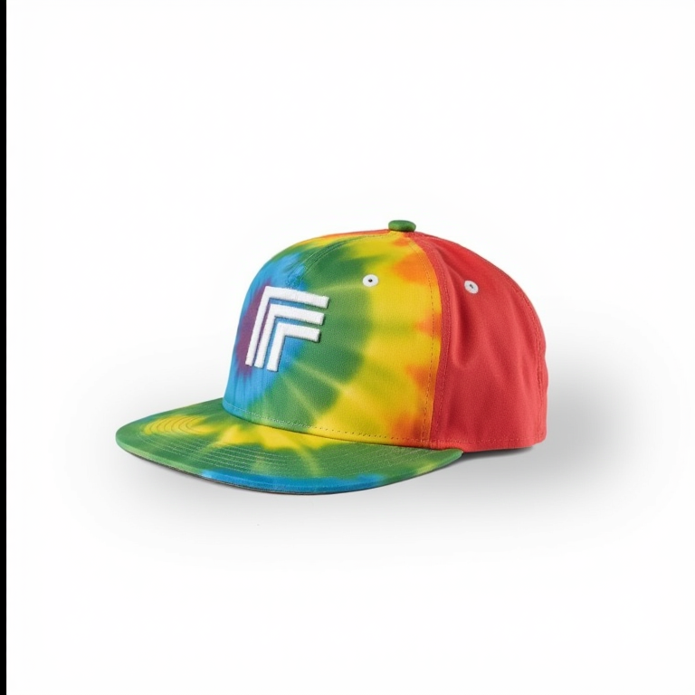

# Logo in Context Replicate Cog Model
 
Cog wrapper for [ali-vilab/In-Context-LoRA](https://huggingface.co/ali-vilab/In-Context-LoRA)

## Example

    cog predict -i logo_image=@logo.png -i logo_description="a white logo on a black background" -i destination_prompt="a rainbow tie dye hat"

# Output

| Input | Output |
|-------|--------|
|  |  |
